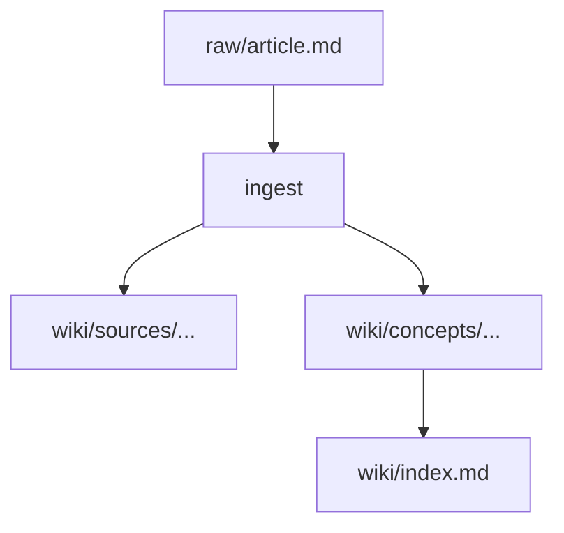

# Article Guide — Writing, Tracing, and Extraction Rules

Guidelines for writing high-quality wiki articles and extracting knowledge.

---

## Line-Level Tracing (MANDATORY)

Every factual claim in the wiki must trace back to a raw source line:

```
The transformer processes all tokens simultaneously via self-attention.
(raw/articles/attention-paper.md, L14-22)
```

**Citation formats:**
| Format | When |
|--------|------|
| `(raw/articles/filename.md, L14-22)` | Line range |
| `(raw/articles/filename.md, L45)` | Single line |
| `(raw/articles/filename.md, location unknown)` | Not found — flag for lint |
| `[synthesis]` | Cross-source inference |

**Rules:**
- Every factual sentence must end with a citation or `[synthesis]` label
- Never paraphrase numeric data — quote verbatim
- WRONG: "approximately 175 billion parameters"
- RIGHT: "175 billion parameters" (raw/articles/gpt3.md, L8)

**Cite the raw file, never the source page.** A citation traces to the immutable
`raw/` evidence so a reader can verify it. A `[[sources/...]]` wikilink points to a
*compiled summary*, which is not evidence — using it as a citation breaks
verify-fresh and clutters the graph with the same link repeated per claim.
- WRONG: `NVDA holds an AA credit rating. ([[sources/nvda-bonds]], L10)`
- RIGHT: `NVDA holds an AA credit rating. (raw/clippings/nvda-bonds.md, L10)`

The source-page wikilink appears **once**, in the page's `## Sources` section, for
navigation — not inline as a citation. (lint check 14 flags inline
`([[sources/...]], Lxx)` citations.)

---

## Confidence Gating

| Sources | Confidence | How set |
|---------|------------|---------|
| 1 | `low` | Auto |
| 3+ | `medium` | Auto |
| 5+, no conflicts | candidate `high` | LLM shows definition + sources to user |
| User confirms | `high` | Only after explicit "confirm" |

- Personal writing does NOT count toward `source_count`
- `confidence: high` = user's active endorsement. **Never automatic.**

---

## Length Targets & Divide-and-Conquer

| Page type | Target length | Notes |
|-----------|--------------|-------|
| Concept page | 400–1200 words | Dense, no padding. **Hard ceiling: 1200.** |
| Folder-split `index.md` | 150–400 words | Definition + map of sub-pages |
| Sub-page under a folder-split | 400–1200 words | Covers one aspect |
| Entity page | 200–500 words | Factual, link-heavy |
| Source summary page | 150–400 words | Takeaways, not a rewrite |
| Synthesis page | 400–1200 words | Cross-source analysis |

### When to split

If a concept page **would** exceed ~1200 words:

1. Create `wiki/concepts/<topic>/`
2. Write `wiki/concepts/<topic>/index.md` (150-400 words: definition + sub-page list)
3. Write each `<aspect>.md` as a focused 400-1200 word page
4. Update `wiki/index.md` with indented bullets showing hierarchy

**Signs a page needs splitting:**
- Word count past 1000
- 3+ top-level `##` sections each with `###` subsections
- Multiple concepts mentioned but not explored
- You want to link to a specific section — it deserves its own page

---

## Concept Extraction Workflow

When ingesting a source (the **same workflow applies to entities** — substitute
`wiki/entities/` and `entity_type`):

1. **Identify concepts/entities** — key ideas, frameworks, techniques, people, tools,
   orgs. Record each in **both languages** when the source gives them (e.g. 注意力机制 /
   Attention Mechanism).
2. **Generate slug** — always lowercase **English**, hyphens: `attention-mechanism`.
   Map a Chinese-only name to its English slug (`第一性原理` → `first-principles-thinking`)
   so the file name is stable regardless of which language the source used.
3. **Alignment check — bilingual, mandatory** (do this BEFORE creating any page):
   - Search `wiki/concepts/` (or `wiki/entities/`) for the slug file.
   - Scan **every existing page's `aliases` field** for a match in **either language** —
     the same idea may already live under a Chinese alias, an English alias, or a
     synonym. Match Chinese↔Chinese, English↔English, AND Chinese↔English.
   - If matched (by slug OR any alias): **UPDATE** the existing page — never create a
     near-duplicate. (lint check 8 catches near-duplicate slugs; aliases catch the rest.)
   - If no match anywhere: **CREATE** a new page from the template, and in `aliases` put
     **both the Chinese and the English name** (plus common synonyms) so the next ingest
     in either language finds it.
4. **For each concept/entity (create or update):**
   - Set `title:` to the **primary-language name** — whichever language `CLAUDE.md`
     § Bilingual format names as primary (see § Bilingual Naming below). The first line /
     `# H1` leads with the primary language and annotates the secondary in `（）`
     (Chinese-primary vault: `中文名（English Name）`).
   - Add the source to the `## Sources` section (once).
   - Append to the Evolution Log (concepts) with the 强化/修正/新增分歧 categorization below.
   - Update `source_count`, `last_reviewed`, `updated`.
   - Keep `aliases` complete and bilingual.
   - Apply line citations to every factual claim.

### Evolution Log Protocol

Never silently overwrite definitions. Log every change, choosing the category by how
the new source relates to the current Definition:

- consistent → **强化 / Reinforced**
- changes the definition → **修正 / Corrected: [what changed]**
- contradicts → **新增分歧 / New conflict: [the disagreement] — see Contradictions**

Format: `- YYYY-MM-DD (N sources): <category> — <one-line description>`

```
## Evolution Log

- 2025-01-10 (1 source): Created from [[sources/paper-a]].
- 2025-02-05 (2 sources): 强化 / Reinforced — [[sources/paper-b]] consistent.
- 2025-03-12 (3 sources): 修正 / Corrected — added distinction between X and Y.
- 2025-04-01 (4 sources): 新增分歧 / New conflict — [[sources/paper-d]] contradicts claim Z (see Contradictions).
```

---

## Bilingual Naming & Term Annotation

`CLAUDE.md` (§ Notes for the LLM) sets the language order. When it is bilingual,
**the first-named language is primary and leads; the second is annotated in
parentheses.** For a `Chinese (primary) + English (secondary)` vault:

- **Body prose** (description, definition, analysis, notes): the **primary language only**
  (Chinese here). Primary-first is not just term labels — the prose itself is primary-language.
- **Section headings (`## …`):** the **primary language only**, never annotated — they are
  generic structural labels, not terms to translate.
  - RIGHT: `## 描述` · `## 定义` · `## 要点` · `## 来源`
  - WRONG: `## 描述（Description）` · `## Description`
- **Page title + a technical term's first appearance:** `中文名（English Name）` — Chinese leads,
  English in parens. This is the **only** place the bilingual pair appears.
  - RIGHT: `经济（Economy）` · `注意力机制（Attention Mechanism）` · `美联储沟通政策（Fed Communication Policy）`
  - WRONG: `Economy（经济）` (English-primary) · bare `Economy` · bare `经济`
- **`title:` frontmatter (concept/entity)** = the **primary-language name** (Chinese, in
  this example) — it is the graph-node label. If an entity has no natural Chinese name (a ticker like `NVDA`),
  lead with the common Chinese name where one exists (`英伟达（NVDA）`); otherwise keep
  the proper name and still record any Chinese alias.
- **`aliases:` frontmatter** holds **all** names, Chinese AND English, so the alignment
  check (below) and search match either language.
- Subsequent appearances of the term in the SAME page: primary (Chinese) only, no repeat.
- Across DIFFERENT pages: re-annotate on first occurrence.
- Uncertain translation: `中文名（tentative: English）` — flag in lint.
- **Slugs/filenames and wikilinks always stay English** lowercase-hyphen
  (`[[concepts/fed-communication-policy]]`), never Chinese — independent of the prose language.

---

## Diagrams — Always Mermaid

ASCII art is banned. Any flow, sequence, hierarchy, or state diagram uses mermaid:

````markdown

````

## Formulas — Always KaTeX

Inline: `$f(x) = \sum_i w_i x_i$`

Block:
```
$$
\mathcal{L}(\theta) = \frac{1}{N}\sum_{i=1}^{N} \ell(f_\theta(x_i), y_i)
$$
```

---

## Wikilink Rules

1. **Link first mention** of every entity or concept
2. **Link maximum twice per article** — don't over-link
3. **Check existing pages** before creating new link targets
4. **For folder-split pages**, link index: `[[concepts/foo/index|Foo]]`
5. **Always use English lowercase-hyphen slugs**: `[[concepts/attention-mechanism]]`
6. **List each target once in list sections.** In `## Concepts Extracted`,
   `## Entities Extracted`, and `## Sources`, every wikilink appears **exactly
   once** — one bullet per unique target, even if the source mentions it many
   times. Never emit a bullet per mention. (lint check 15 flags duplicates.)

**Forbidden targets:**
- System files: `[[log]]` `[[index]]` `[[overview]]` `[[QUESTIONS]]`
- Output files: `[[outputs/...]]`

---

## Handling Contradictions

When two sources contradict:

1. State both claims explicitly
2. Note which source supports each claim
3. Add to the article's "Contradictions" section AND `CLAUDE.md` research questions
4. Do NOT silently pick one — contradictions are valuable signal

---

## Anti-Drift Defenses

### Defense 1 — Line-Level Annotation
Every factual claim traced to exact source lines.

### Defense 2 — Verbatim Numbers
All numeric data quoted verbatim. Never paraphrased.

### Defense 3 — Monthly Deep Lint
Randomly select 5 source pages, compare sentence-by-sentence against raw files.

### Defense 4 — SHA-256 Integrity
At ingest: `hashlib.sha256()` of raw file, stored in frontmatter.
At lint: recompute and compare. If changed: `WARNING SOURCE MODIFIED`.
