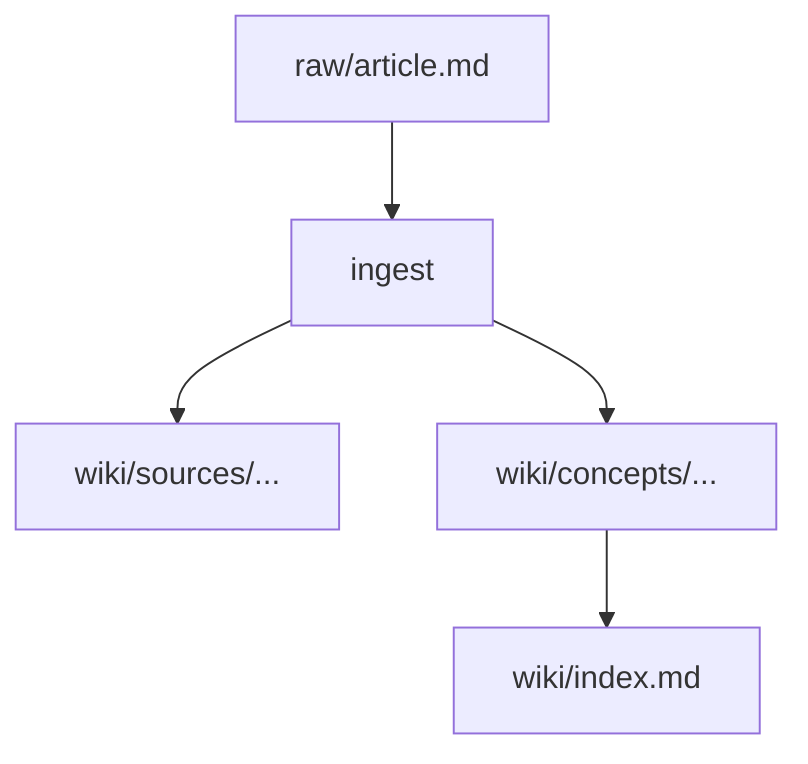

# Article Guide — Writing, Tracing, and Extraction Rules

Guidelines for writing high-quality wiki articles and extracting knowledge.

---

## Line-Level Tracing (MANDATORY)

Every factual claim in the wiki must trace back to a raw source line:

```
The transformer processes all tokens simultaneously via self-attention.
(raw/articles/attention-paper.md, L14-22)
```

**Citation formats:**
| Format | When |
|--------|------|
| `(raw/articles/filename.md, L14-22)` | Line range |
| `(raw/articles/filename.md, L45)` | Single line |
| `(raw/articles/filename.md, location unknown)` | Not found — flag for lint |
| `[synthesis]` | Cross-source inference |

**Rules:**
- Every factual sentence must end with a citation or `[synthesis]` label
- Never paraphrase numeric data — quote verbatim
- WRONG: "approximately 175 billion parameters"
- RIGHT: "175 billion parameters" (raw/articles/gpt3.md, L8)

---

## Confidence Gating

| Sources | Confidence | How set |
|---------|------------|---------|
| 1 | `low` | Auto |
| 3+ | `medium` | Auto |
| 5+, no conflicts | candidate `high` | LLM shows definition + sources to user |
| User confirms | `high` | Only after explicit "confirm" |

- Personal writing does NOT count toward `source_count`
- `confidence: high` = user's active endorsement. **Never automatic.**

---

## Length Targets & Divide-and-Conquer

| Page type | Target length | Notes |
|-----------|--------------|-------|
| Concept page | 400–1200 words | Dense, no padding. **Hard ceiling: 1200.** |
| Folder-split `index.md` | 150–400 words | Definition + map of sub-pages |
| Sub-page under a folder-split | 400–1200 words | Covers one aspect |
| Entity page | 200–500 words | Factual, link-heavy |
| Source summary page | 150–400 words | Takeaways, not a rewrite |
| Synthesis page | 400–1200 words | Cross-source analysis |

### When to split

If a concept page **would** exceed ~1200 words:

1. Create `wiki/concepts/<topic>/`
2. Write `wiki/concepts/<topic>/index.md` (150-400 words: definition + sub-page list)
3. Write each `<aspect>.md` as a focused 400-1200 word page
4. Update `wiki/index.md` with indented bullets showing hierarchy

**Signs a page needs splitting:**
- Word count past 1000
- 3+ top-level `##` sections each with `###` subsections
- Multiple concepts mentioned but not explored
- You want to link to a specific section — it deserves its own page

---

## Concept Extraction Workflow

When ingesting a source:

1. **Identify concepts** — key ideas, frameworks, techniques
2. **Generate slug** — lowercase English, hyphens: `attention-mechanism`
3. **Alignment check** (mandatory):
   - Search `wiki/concepts/` for the slug file
   - Scan ALL existing concept pages' `aliases` fields
   - If match found (slug OR alias): **UPDATE** existing page
   - If no match: **CREATE** new page from template
4. **For each concept (create or update):**
   - Add source to Sources section
   - Append to Evolution Log
   - Update `source_count`, `last_reviewed`, `updated`
   - Apply secondary language annotation if configured
   - Apply line citations to every claim

### Evolution Log Protocol

Never silently overwrite definitions. Log every change:

```
## Evolution Log

- 2025-01-10 (1 source): Created from [[sources/paper-a]].
- 2025-02-05 (2 sources): Reinforced. [[sources/paper-b]] consistent.
- 2025-03-12 (3 sources): Corrected: added distinction between X and Y.
- 2025-04-01 (4 sources): New conflict: [[sources/paper-d]] contradicts claim Z.
```

---

## Secondary Language Annotation

When a secondary language is set in `CLAUDE.md` (§ Notes for the LLM):

- Annotate each NEW term on FIRST appearance per article: `Term（译名）`
- Subsequent appearances in SAME article: Term only. No repeat.
- Across DIFFERENT articles: re-annotate on first occurrence.
- Uncertain translation: `Term（tentative: 候选）` — flag in lint.

---

## Diagrams — Always Mermaid

ASCII art is banned. Any flow, sequence, hierarchy, or state diagram uses mermaid:

````markdown

````

## Formulas — Always KaTeX

Inline: `$f(x) = \sum_i w_i x_i$`

Block:
```
$$
\mathcal{L}(\theta) = \frac{1}{N}\sum_{i=1}^{N} \ell(f_\theta(x_i), y_i)
$$
```

---

## Wikilink Rules

1. **Link first mention** of every entity or concept
2. **Link maximum twice per article** — don't over-link
3. **Check existing pages** before creating new link targets
4. **For folder-split pages**, link index: `[[concepts/foo/index|Foo]]`
5. **Always use English lowercase-hyphen slugs**: `[[concepts/attention-mechanism]]`

**Forbidden targets:**
- System files: `[[log]]` `[[index]]` `[[overview]]` `[[QUESTIONS]]`
- Output files: `[[outputs/...]]`

---

## Handling Contradictions

When two sources contradict:

1. State both claims explicitly
2. Note which source supports each claim
3. Add to the article's "Contradictions" section AND `CLAUDE.md` research questions
4. Do NOT silently pick one — contradictions are valuable signal

---

## Anti-Drift Defenses

### Defense 1 — Line-Level Annotation
Every factual claim traced to exact source lines.

### Defense 2 — Verbatim Numbers
All numeric data quoted verbatim. Never paraphrased.

### Defense 3 — Monthly Deep Lint
Randomly select 5 source pages, compare sentence-by-sentence against raw files.

### Defense 4 — SHA-256 Integrity
At ingest: `hashlib.sha256()` of raw file, stored in frontmatter.
At lint: recompute and compare. If changed: `WARNING SOURCE MODIFIED`.
